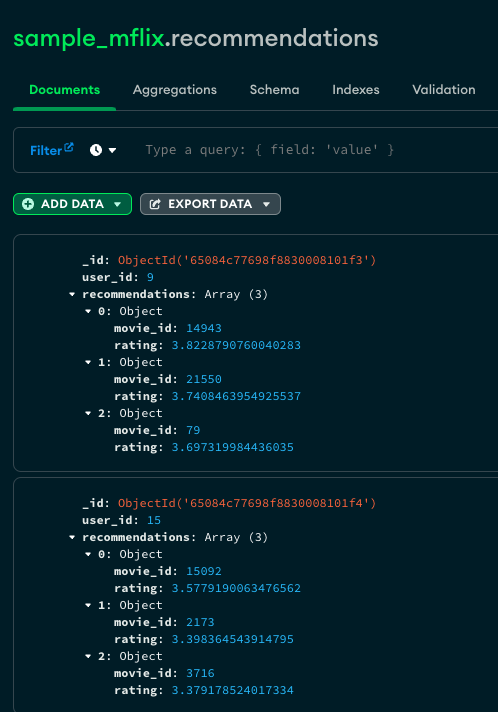
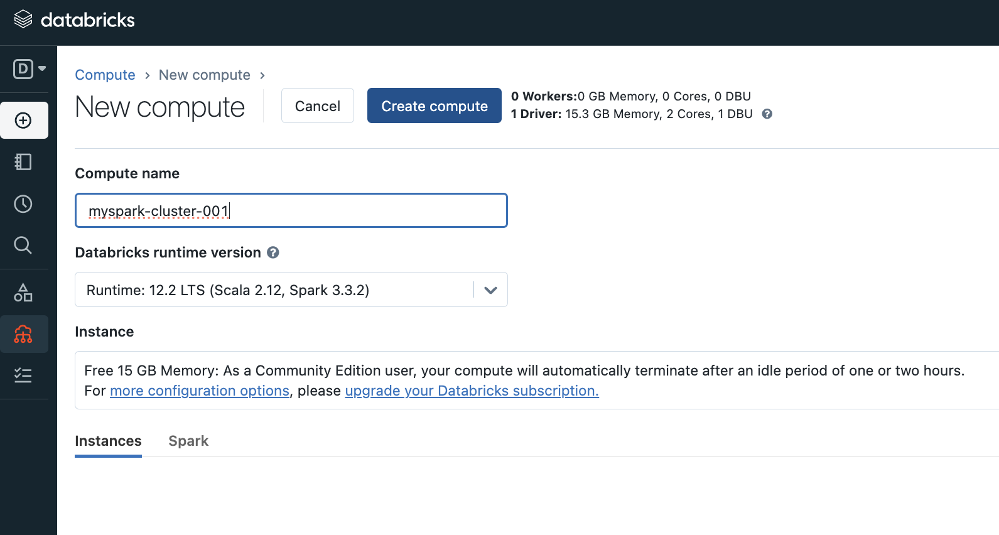
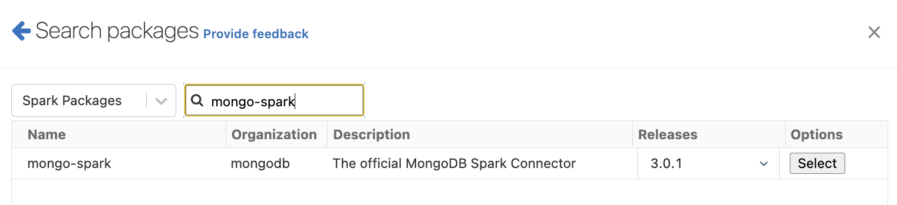
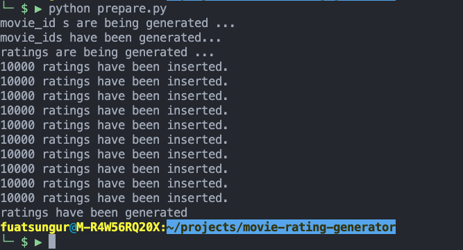
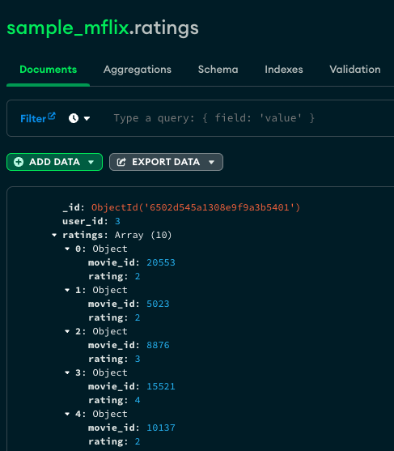

# MongoDB Movie Recommendation with Spark

After the execution of the this tutorial you'll end up having a new collection with the name `recommendations` that contains the top 3 recommended

You can watch the following video to see how it works.

# Steps

## 1. Having an Atlas Cluster with the Sample Dataset Loaded

Load the default MongoDB Atlas Sample Dataset into a MongoDB Atlas Cluster (for demonstration only, M10 tier should be enough). Follow the tutorial on the link: https://docs.atlas.mongodb.com/sample-data/

You will have `sample_mflix` database. We will later add `movie_id` field to `movies` collection and we will add another collection `rating` to keep movie ratings for each user.

## 2. Configure Apache Spark

### 2.1 Having a Spark Cluster

You may consider provisioning a spark cluster by using Databricks Community Edition. It's going to be free and will be enough for the demonstration.

### 2.2 Importing MongoDB Spark Library into Spark Environment

In order to connect to MongoDB, you need to import `mongo-spark` library into Spark Environment.

## 3. Configure the Dataset in Atlas

We need to modify our dataset to prepare it to be trained for machine learning. And we require the following 2 changes:

- We need to have integer value of movie_id information and therefore we cannot use the existing `_id` field of the `movies` collection since the field type is `ObjectId`.
- We also need to generate ratings for the users. We will have another collection `ratings` that will keep 10 ratings for each user.

In order to achive this we'll run the `prepare.py` python script. Please have a look at it and update the connection string accordingly.

The python version and the libraries that I used and worked:
- Python 3.9.2
- pymongo==4.3.3

After you run the script, you should have the following:

- `movies` collection to have `movie_id` field:

- `ratings` collection in the `sample_mflix` database:

## 4. Running the Ipython Notebook

Import the IPython notebook `MongoDB-Movie-Recommendation.ipynb` and run it. 

## 5. Observe the output collection

Output collection `recommendations` will have the recommendation for each user.

